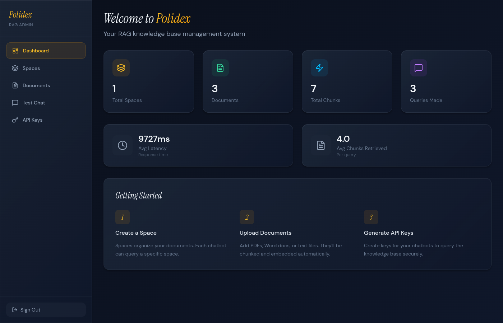
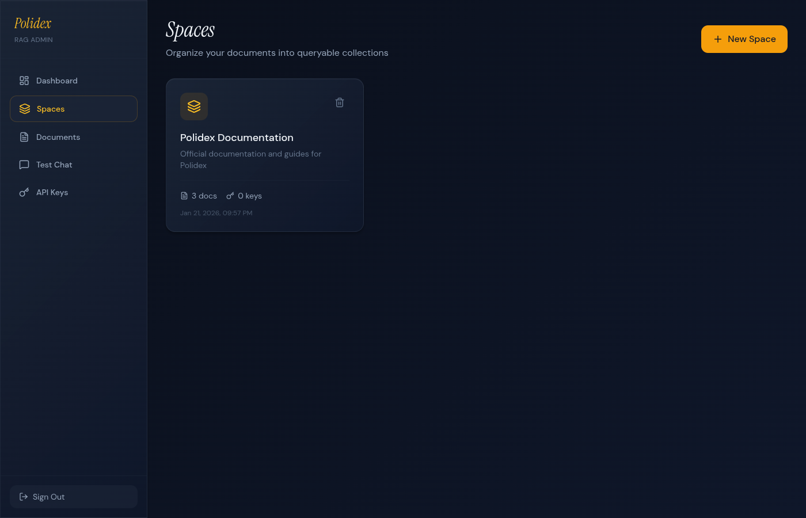
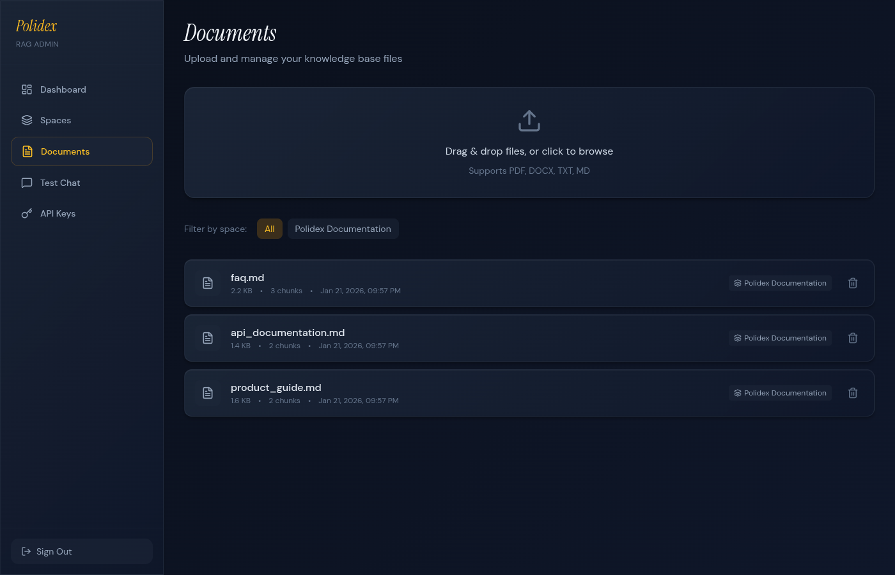
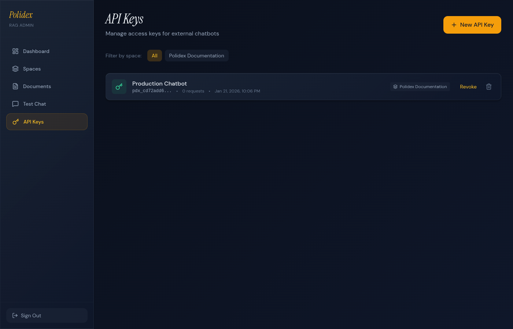

# Polidex

A modern RAG (Retrieval-Augmented Generation) admin system for managing knowledge bases that power AI chatbots.



## Features

- **Document Management** - Upload PDF, DOCX, TXT, and Markdown files
- **Automatic Processing** - Documents are chunked and embedded for semantic search
- **Space Organization** - Organize documents into isolated knowledge bases
- **Test Chat** - Query your knowledge base directly from the admin panel
- **External API** - REST API with API key authentication for chatbot integration
- **Source Citations** - Every response includes relevant source documents

## Screenshots

### Spaces
Organize your documents into separate knowledge bases.



### Documents
Upload and manage your knowledge base files with drag-and-drop.



### Test Chat
Query your knowledge base and see RAG responses with source citations.


### API Keys
Generate and manage API keys for external chatbot access.



## Tech Stack

| Component | Technology |
|-----------|------------|
| Backend | FastAPI (Python) |
| Vector DB | ChromaDB |
| Metadata DB | SQLite + SQLAlchemy |
| Embeddings | sentence-transformers (all-MiniLM-L6-v2) |
| LLM | OpenRouter API |
| Frontend | React + Vite + Tailwind CSS |

## Quick Start

### Prerequisites

- Docker and Docker Compose
- OpenRouter API key

### Setup

1. Clone the repository:
```bash
git clone https://github.com/yourusername/polidex.git
cd polidex
```

2. Create `.env` file in the `backend` directory:
```env
OPENROUTER_API_KEY=sk-or-v1-your-api-key
SECRET_KEY=your-secret-key
ADMIN_TOKEN=your-admin-token
DATABASE_URL=sqlite:///./data/polidex.db
CHROMA_PERSIST_DIR=./data/chroma
EMBEDDING_MODEL=sentence-transformers/all-MiniLM-L6-v2
DEFAULT_LLM_MODEL=openai/gpt-4o-mini
```

3. Start the application:
```bash
docker compose up -d
```

4. Open http://localhost:3000 in your browser

Demo data with sample documentation is automatically created on first startup.

## API Usage

### Authentication

All external API requests require an API key:

```
X-API-Key: pdx_your_api_key_here
```

### Query Endpoint

**POST** `/api/v1/query`

```json
{
  "query": "How do I create a new space?",
  "top_k": 5,
  "system_prompt": "You are a helpful assistant."
}
```

**Response:**

```json
{
  "answer": "To create a new space...",
  "sources": [
    {
      "document_id": 1,
      "filename": "guide.md",
      "chunk_index": 3,
      "content": "...",
      "score": 0.85
    }
  ]
}
```

## Project Structure

```
polidex/
├── backend/
│   ├── app/
│   │   ├── api/routes/      # API endpoints
│   │   ├── core/            # Auth, OpenRouter client
│   │   ├── models/          # SQLAlchemy models
│   │   └── services/        # RAG pipeline, embeddings
│   └── data/                # SQLite & ChromaDB storage
├── frontend/
│   └── src/
│       ├── components/      # React components
│       ├── pages/           # Page components
│       └── lib/             # API client, utilities
└── docker-compose.yml
```

## Environment Variables

| Variable | Description | Default |
|----------|-------------|---------|
| `OPENROUTER_API_KEY` | OpenRouter API key | Required |
| `SECRET_KEY` | Application secret | Required |
| `ADMIN_TOKEN` | Admin authentication token | Optional |
| `DATABASE_URL` | SQLite database URL | `sqlite:///./data/polidex.db` |
| `CHROMA_PERSIST_DIR` | ChromaDB storage path | `./data/chroma` |
| `DEFAULT_LLM_MODEL` | Default LLM model | `openai/gpt-4o-mini` |
| `CHUNK_SIZE` | Document chunk size | `1000` |
| `CHUNK_OVERLAP` | Chunk overlap | `200` |
| `RATE_LIMIT` | API rate limit | `60/minute` |

## License

GPL v3
